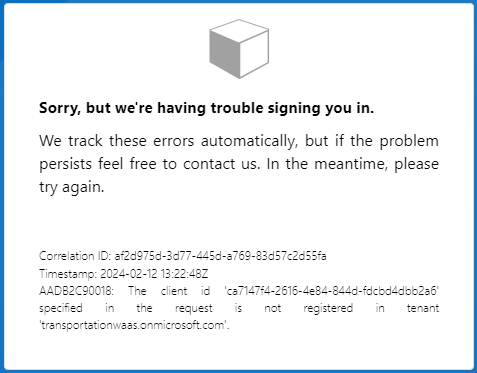
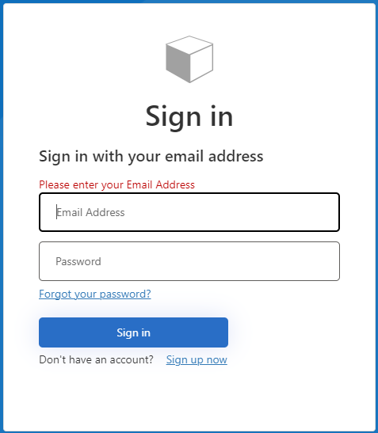
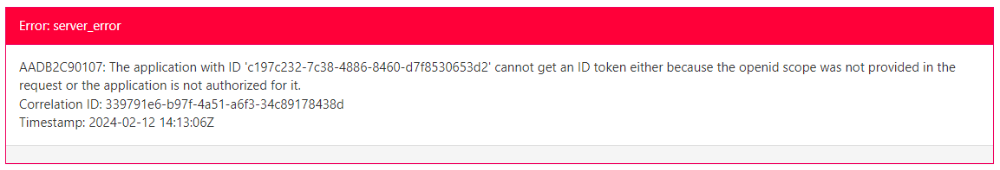

# Tutorial: Set up sign in for an ASP.NET application using Azure Active Directory B2C

Here are the steps I took to set up my Azure Active Directory B2C demo app.

- The first thing I tried was [quickstart-web-app-dotnet](https://learn.microsoft.com/en-us/azure/active-directory-b2c/quickstart-web-app-dotnet), but was unsucessfull in getting the app to run. The problem I was running into was with the `Owin` dependancy which the project depends on. The project expects version 1.0.1 but [Owin](https://www.nuget.org/packages/Owin/1.0.0?_src=template) only has version 1.0.0 available and changing the dependancy to this version also didn't work. Since this sample app uses a .NET web app I'm going to skip over the quick start and follow the other tutorials which explain how to add Azure AD to an existing .NET web api.

1. [Tutorial: Create an Azure Active Directory B2C tenant](https://learn.microsoft.com/en-us/azure/active-directory-b2c/tutorial-create-tenant)

   - If using the Ephemral subscription I have already registered Microsoft.AzureActiveDirectory in resource providers.
   - Note that you will also require `Tennant Creator` role, which you will NOT get unless ur sam... So ask sam...
     - Once the B2C tennant is created ask for the following roles under the newly created tennant:
       - `Application Developer`
       - `External ID User Flow Administrator`
     - If you were able to create the Tennant yourself than you will automatically be granted `global admin`.

2. CAUTION: Azure considers a "web application" to be a traditional web application that performs most of the application logic on the server. So for our purposes this will be our .NET Core Web API!!! Our Frontend app on the other hand is considered a SPA (single page applications) for app registration purposes!!! We will need to regeister **BOTH** our React App as well as our .NET Core web api.

   - I was able to complete 2A and 2B with the list of roles mentioned above. Meaning it's doable without `global admin`.
   - Make sure to copy the app secret values directly after generating them in these steps! "This secret value is never displayed again after you leave this page".

   2A. [Tutorial: Register a web application in Azure Active Directory B2C](https://learn.microsoft.com/en-us/azure/active-directory-b2c/tutorial-register-applications)

   2B. [Register a single-page application in Azure Active Directory B2C](https://learn.microsoft.com/en-us/azure/active-directory-b2c/tutorial-register-spa)

   - Note: web app tutorial had me generate an app secret but the spa tutorial did NOT. Come back to this later if you run into problems...

3. [Tutorial: Create user flows and custom policies in Azure Active Directory B2C](https://learn.microsoft.com/en-us/azure/active-directory-b2c/tutorial-create-user-flows?pivots=b2c-user-flow)

- I selected `User Flow` which is the default policy type.
- Didn't work...
  - 
- I can't remember exactly which setting it was that I changed but try the following:
  - Go to app registrations -> web app / spa -> Authentication. Ensure you have `implicit grant` enabled.
  - Also under `Grant types` there might be an error/warning message about your redirect url. Click on it then select your redirect url and finally **configure**.
- These steps worked for my web app but not the spa...
  - The "Run user flow" experience is not currently compatible with the SPA reply URL type using authorization code flow. To use the "Run user flow" experience with these kinds of apps, [register a reply URL of type "Web" and enable the implicit flow..](https://learn.microsoft.com/en-us/azure/active-directory-b2c/tutorial-register-spa#enable-the-implicit-flow)
- It may also be worth looking into MSAL.js 2.0 or later. If were going to be using MSAL 2.0+ then we should NOT enable implicit flow grant and this might also fix this issue. See [Enable the implicit flow](MSAL.js 2.0 or later) for details.
  - Infact microsoft actually recommends this... see [Migrate from the implicit flow](https://learn.microsoft.com/en-us/azure/active-directory-b2c/tutorial-register-spa#migrate-from-the-implicit-flow).
- I was still unable to get the spa app registration to work with `Run user flow` but the documentation makes me think this has to do with the limitations of testing it in azure... We'll see.

Takeaway: Use MSAL 2.0+ and DON'T use Implicit grant. I just didn't find this recomendation until afterwards.

Now lets test the user flow with the web app registration we made.

After signing up and being redirected to jwt.ms I got the following error:

I'm going to ignore these errors since I followed the tutorials and hope it's just a problem with the testing feature in azure. So next up will be:

- [Configure authentication in a sample single-page application by using Azure AD B2C](https://learn.microsoft.com/en-us/azure/active-directory-b2c/configure-authentication-sample-spa-app)
- [Enable authentication in your own web API by using Azure AD B2C](https://learn.microsoft.com/en-us/azure/active-directory-b2c/enable-authentication-web-api?tabs=csharpclient)

1. fsdfds
