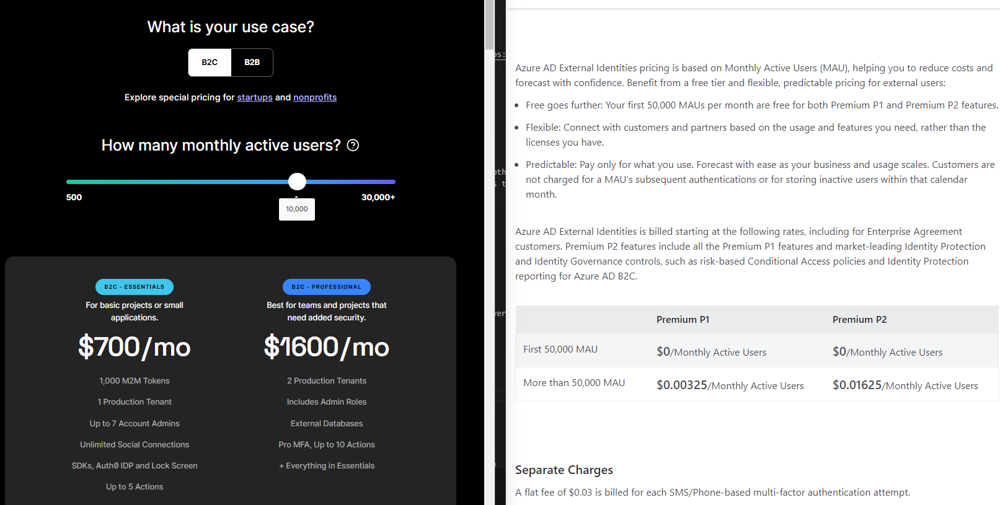

# User Auth Challenges

2/16/2024 - @BBITWestin & ~~@BBIIWest~~ (YOU GOTTA EARNNNNN IT)

## Challenges

- User Authentication & Authorization
  - Sign Up
  - Email Invites
  - Authorization Schema to View Load and Customer Level Data
    - Management Portal and Admin Users Managing Authorization Schema

## Goals

- Offset as much authentication and authorization tasks and logic to an **identity as a service provider**
  - Authentication/Authorization shouldn't rely on tables in our database
- Scalable authorization schema
  - Onbording new customers/clients should be automated with little to no action required on our end

## 1. Access Control - ian was here

Access control governs who can access particular data, applications, and resources inside an organization and under what circumstances. Here are the three popular access control types:

1. Role Based (RBAC)
2. Claim Based (CBAC)
3. Permission Based (PBAC)

### Role Based Access Control (RBAC)

Limits access based on user's role.

#### Advantages

- Policies can be assigned to user groups instead of manually to individuals.
- Integrating third-party users is also more secure with RBAC, as we can give them strictly defined roles and permissions.

#### Disadvantages

- Roles minimize the potential for altering the permissions for a single user or group of users, forcing us to create new roles to give them a customized set of permissions.

### 2. Claim Based Access Control (CBAC)

We can use claims-based access control, also known as attribute-based access control (ABAC), either as a replacement or a supplement to RBAC to provide more granular access control.

CBAC restricts and provides access to critical resources based on a combination of three factors:

1. User's identity
2. User's responsibilities
3. The context of the action performed

### Example:

The second I get assigned to Herzog's team I should have access to his load board.

#### Advantages

- Policies can be precisely defined, targetting specific attributes rather than the roles of the users.
- Dynamic access: Since rules can be specified based on environmental parameters, access control can be done at runtime by evaluating the context.

#### Disadvantages

- Granularity introduces complexity.

### 3. Permission Based Access Control (PBAC)

Permission-based access control focuses on defining the set of actions each user is allowed to perform on each resource. Think CRUD.

These rules should be specified for each user as a pair, indicating the resources and the permitted actions such as view, create, edit, and delete.

#### Example

Herzog needs my help on a load for the day. He gives me permission in some admin dashboard... hidden behind other policy's Herzog has access to.

#### Advantages

- Fine granularity: Permission can be defined flexibly for each entity for each resource in the system.

#### Disadvantages

- Less scalable: When the number of users is high, how can we ensure were managing permissions for each user correctly.

### Other Notes

We would be best off setting something up to keep logs of any time a role, claim, or permission is updated.

## Auth Services

So how can we actually implement authentication and then access control?

### ~~MS Entra Preview~~ / ~~MS Entra External Preview~~ :bricks:

Preview = :shit: :wastebasket: :boom: :fire: :ambulance:

[Microsoft Entra Verified ID now in Public Preview](https://www.microsoft.com/en-us/security/business/solutions/decentralized-identity)

[Microsoft Entra External ID now in Public Preview](https://www.microsoft.com/en-us/security/business/identity-access/microsoft-entra-external-id)

### Azure AD B2C

[Azure Active Directory B2C](https://learn.microsoft.com/en-us/azure/active-directory-b2c/overview) provides business-to-customer identity as a service.

- [Technical and feature overview of Azure Active Directory B2C](https://learn.microsoft.com/en-us/azure/active-directory-b2c/technical-overview)
- Azure AD seems to lack any sort of dedicated method of permission based access conrol or even claims based. Although they do offer custom user attibutes and claims leaving it up to us. Its questionable if we can integrate these custom attibutes into our app, meaning how can user1A manage user1B's custom atributes in our frontend? `More research needed`.

### Auth0

[Auth0](https://auth0.com/docs/get-started/auth0-overview) is another drop-in solution to add authentication and authorization services to your app.

### Azure AD B2C vs Auth0

- Both are going to come along with all the features we should ever need.
- Anecdotes online mention having an easy time getting Auth0 set up compared to Azure AD, but others mention the steep price differences as well.

#### Pricing

- Azure AD [pricing](https://azure.microsoft.com/en-us/pricing/details/active-directory-external-identities/)
- Auth0 [pricing](https://auth0.com/pricing)

Assuming 10,000 active monthly users Azure AD scales much cheaper at $0.01625/Monthly Active Users for Premium P2 (highest) vs Auth0's $0.16 / MAU for B2C (PROFESSIONAL) or $0.07 / MAU for B2C (ESSENTIALS).

### Links

- Azure AD [pricing](https://azure.microsoft.com/en-us/pricing/details/active-directory-external-identities/)
- Auth0 [pricing](https://auth0.com/pricing)
- [How to Choose the Right Type of Access Control for your Project](https://amplication.com/blog/choosing-between-role-based-vs-claims-based-vs-permission-based-access-control-mechanism)

# Next steps

Choose between [Azure AD B2C vs Auth0 for OUR use case](https://github.com/BBITWestin/My-Docs/blob/main/Auth/Authorization_Schema.md).
