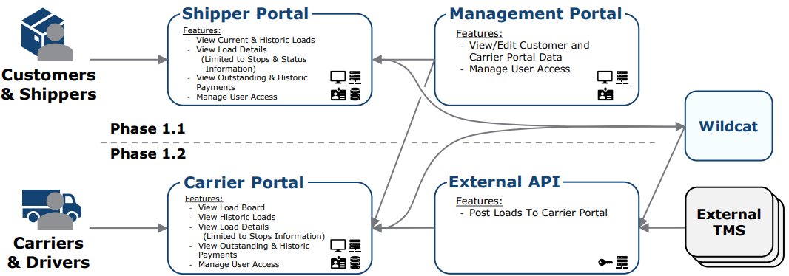

# Project Portal: Authorization Schema

2/13/2024 - @BBITWestin

This document explains the authorization schema goals for WaaS then explores what implementation options Azure AD B2C and Auth0 offer for [Role based, Claims based, and Permission based access control](https://github.com/BBITWestin/My-Docs/blob/main/Auth/Auth-Challenges.md).

## Description & Goals for Authorization Schema

From boss man @BBIJAllen.

- We want individual and team-based authorization at the `branch`, `customer`, and `load` level.
- `Branches` have `customers`. `Customers` have `loads`.
  - If you have admin access at the branch level, then you have admin access to all of the branch’s customers and Admin access to all those customers’ loads.
  - If you have admin access at the customer level, then you have admin access to all of the customer’s loads.
- We are likely sticking to the _assignment relationship_ between loads and customers, so multiple different customers can be on one load. When that happens people with customer level access for different customers on the same load will have their respective access to the shared load.
- Branches and customers will likely be linked via a joinder table so branches can share customers. Loads will likely hold a relationship to branch so we can parse loads to the branch when the customer is shared between multiple branches.
- Users can be assigned to teams. Then those teams can be given branch, customer, and load level access.
- Super admins can set policies on what admin and default users can do. Examples:
  - Ability to set whether default users can cancel loads or not.
  - Ability for anyone to see the customer’s name, even if that user doesn’t have customer or load access.
  - Ability to set the visibility of a load for users who lack access to that load, allowing them to view the load without editing privileges.

#### Potential Access Levels

    Admin

    - Control the access level of other users on the branch, customer, and load.
    - Access to manual overrides.

    Financial

    - Ability to edit the financial components of a load/assignment after a load is sent to accounting.
    - Ability to view and interact with the accounting features of the application for the respective branch/customer/load.

    Default

    - Don’t have access to edit loads after the load is sent to accounting or claims.
    - Don’t have access to the accounting features of the application.

    Super Admin

    - Ability to set policies for the organization.
    - Organization level access: not related to branch, customer, and load level access. But they have admin access for everything.
    - Example: Brent and Matt would be Super Admins for the BBI Logistics organization.

## Recapp of our Users

Lets reclarify what types of users we'll be dealing with and what resources were concered about protecting.

`Customers/Shippers` AND `Carriers/Drivers` will be logging in through different portals but for auth purposes were just concerned about making sure they can view their loads.

`Brokers` will be logging in through the management portal and should be able to view and edit customers and their customers loads. Only the management portal will be able to made edits so we don't need to worry about differentiating `view` vs `edit` access for customers/loads.

So as it pertains to access control we care only about 2 things regardless of which portal they are logging into... viewing `Load Details`, and `Load Financial Details`. Viewing `Load Details`/`Load Financial Details` can be on a per user or per team basis.

The _super admins_ for a customers company

## Azure AD B2C Features... for use case

### Roles

- Note that the Azure AD custom roles AND groups feature is currently not available for Azure AD B2C directories.
  - Any roles specified using the App Registration get applied and returned in the token only when the authenticated against standard Azure AD and not Azure AD B2C. See [here](https://learn.microsoft.com/en-us/answers/questions/1056490/roled-based-authorization-in-azure-ad-b2c) for details.

### Custom Attributes / Claims

Custom attributes are defined in the Azure AD B2C tenant, and once created, they can be used to collect additional information during user registration or through profile editing flows. They can also be included in tokens as claims, making them accessible to your application without the need for additional API calls.

#### Azure AD Demo

Follow the steps in my [AzAd_Setup](https://github.com/BBITWestin/My-Docs/blob/main/Auth/AzAD_Setup.md) doc to get a feel for how to implement Azure AD B2C. I tried my best to document every step I took and the problems (along with solutions) I encountered along the way, but it's still gonna be a pain to recreate, good luck.

## Auth0 Features... for use case

#### Auth0 Demo

...Bpaid?!

## Links

- [Become best friends with Azure AD B2C (My AzAd_Demo_Walkthrough)](https://github.com/BBITWestin/My-Docs/blob/main/Auth/AzAD_Setup.md)

# Next steps

Finally here is our [Implementation Blueprint](https://github.com/BBITWestin/BBITWestin.github.io/blob/main/Auth/Auth-Proposal.md) for our use case.
