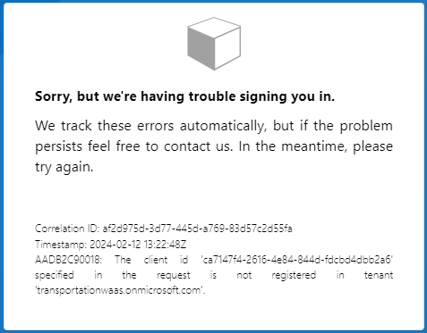
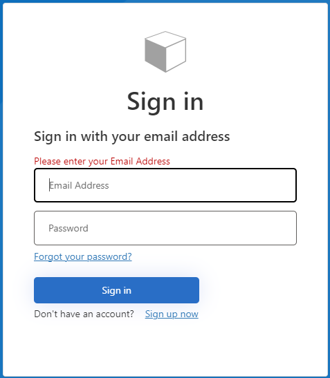
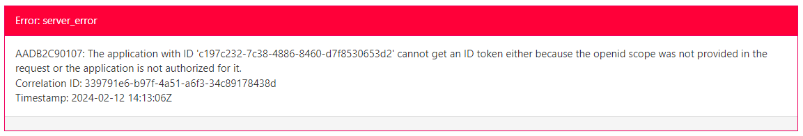
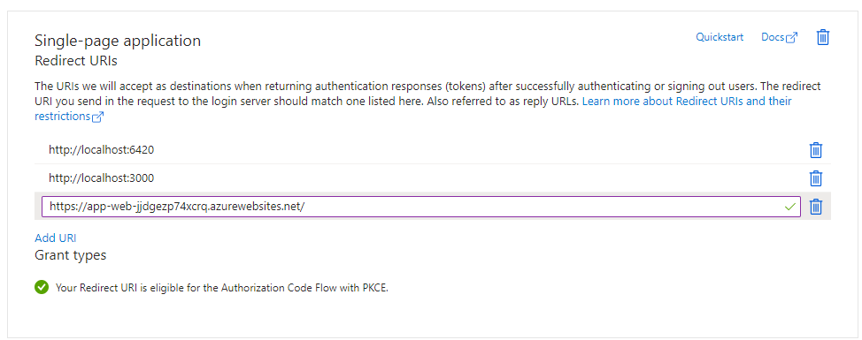
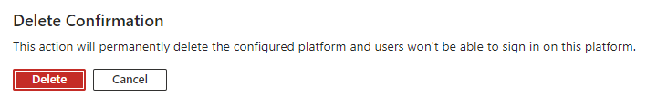

# Tutorial: Set up sign in for an ASP.NET application using Azure Active Directory B2C

2/13/2024 - @BBITWestin

Here are the steps I took to set up my Azure Active Directory B2C demo app.

For the first working demo see [ATTEMPT 3](#ATTEMPT-3).

## ATTEMPT 1

- The first thing I tried was [quickstart-web-app-dotnet](https://learn.microsoft.com/en-us/azure/active-directory-b2c/quickstart-web-app-dotnet), but was unsuccessful in getting the app to run. The problem I was running into was with the 'Owin' dependency which the project depends on. The project expects version 1.0.1 but [Owin](https://www.nuget.org/packages/Owin/1.0.0?_src=template) only has version 1.0.0 available and changing the dependency to this version also didn't work. Since this sample app uses a .NET web app I'm going to skip over the quick start and follow the other tutorials which explain how to add Azure AD to an existing .NET web api.

## ATTEMPT 2

- This attempt was completed without api permissions granted admin consent. This attempt didn't work with testing user flows but I left my notes here anyways because it was still a great way to introduce yourself to all the services within Azure B2C.
  - You might be able to get around some of the trouble spots I mention with `app admin` role. Without this role simply ask sam to grant api permissions for the application registration you are dealing with.

1. [Tutorial: Create an Azure Active Directory B2C tenant](https://learn.microsoft.com/en-us/azure/active-directory-b2c/tutorial-create-tenant)

   - If using the Ephemral subscription I have already registered Microsoft.AzureActiveDirectory in resource providers.
   - Note that you will also require `Tennant Creator` role, which you will NOT get unless ur sam... So ask sam...
     - Once the B2C tennant is created ask for the following roles under the newly created tennant:
       - `Application Developer`
       - `External ID User Flow Administrator`
     - If you were able to create the Tennant yourself than you will automatically be granted `global admin`.

2. CAUTION: Azure considers a "web application" to be a traditional web application that performs most of the application logic on the server. So for our purposes this will be our .NET Core Web API!!! Our Frontend app on the other hand is considered a SPA (single page applications) for app registration purposes!!! We will need to register **BOTH** our React App as well as our .NET Core web api.

   - I was able to complete 2A and 2B with the list of roles mentioned above. Meaning it's doable without `global admin`.
   - Make sure to copy the app secret values directly after generating them in these steps! "This secret value is never displayed again after you leave this page".

   2A. [Tutorial: Register a web application in Azure Active Directory B2C](https://learn.microsoft.com/en-us/azure/active-directory-b2c/tutorial-register-applications)

   2B. [Register a single-page application in Azure Active Directory B2C](https://learn.microsoft.com/en-us/azure/active-directory-b2c/tutorial-register-spa)

   - Note: web app tutorial had me generate an app secret but the spa tutorial did NOT. Come back to this later if you run into problems...

3. [Tutorial: Create user flows and custom policies in Azure Active Directory B2C](https://learn.microsoft.com/en-us/azure/active-directory-b2c/tutorial-create-user-flows?pivots=b2c-user-flow)

- I selected `User Flow` which is the default policy type.
- Didn't work...
  - 
- I can't remember exactly which setting it was that I changed but try the following:
  - Go to app registrations -> web app / spa -> Authentication. Ensure you have `implicit grant` enabled.
  - Also under `Grant types` there might be an error/warning message about your redirect url. Click on it then select your redirect url and finally **configure**.
- These steps worked for my web app but not the spa...
  - The "Run user flow" experience is not currently compatible with the SPA reply URL type using authorization code flow. To use the "Run user flow" experience with these kinds of apps, [register a reply URL of type "Web" and enable the implicit flow..](https://learn.microsoft.com/en-us/azure/active-directory-b2c/tutorial-register-spa#enable-the-implicit-flow)
- It may also be worth looking into MSAL.js 2.0 or later. If were going to be using MSAL 2.0+ then we should NOT enable implicit flow grant and this might also fix this issue. See [Enable the implicit flow](MSAL.js 2.0 or later) for details.
  - Infact microsoft actually recommends this... see [Migrate from the implicit flow](https://learn.microsoft.com/en-us/azure/active-directory-b2c/tutorial-register-spa#migrate-from-the-implicit-flow).
- I was still unable to get the spa app registration to work with `Run user flow` but the documentation makes me think this has to do with the limitations of testing it in azure... We'll see.

Takeaway: Use MSAL 2.0+ and DON'T use Implicit grant. I just didn't find this recommendation until afterwards.

Now lets test the user flow with the web app registration we made.


After signing up and being redirected to jwt.ms I got the following error:


I'm going to ignore these errors since I followed the tutorials and hope it's just a problem with the testing feature in azure.

## ATTEMPT 3

- [Configure authentication in a sample single-page application by using Azure AD B2C](https://learn.microsoft.com/en-us/azure/active-directory-b2c/configure-authentication-sample-spa-app)
  - THIS TIME HAVE SAM GRANT ADMIN CONSENT TO MS GRAPH API PERMISSIONS WHEN REGISTERING APPS!
  - Working demo can be found here: [BBITWestin/auth-sample-app1](https://github.com/BBITWestin/auth-sample-app1)
    - Run the Node.js web API
      ```bash
        cd active-directory-b2c-javascript-nodejs-webapi
        npm install && npm update
        node index.js
      ```
    - Run the Node.js web API
      ```bash
        cd ms-identity-b2c-javascript-spa
        npm install && npm update
        npm start
      ```
    - Go to `http://localhost:6420`

# Next Steps... Enable authentication in **OUR** projects.

The demo above proves we can get away with setting up Azure AD B2C with `Application Developer`, `External ID User Flow Administrator`, and Sam (`Application Admin`). Now that we've gone through the process of registering applications and creating user flows lets try and apply this process to an existing frontend / backend repo. For this demo I created a new fork from [todo-csharp-sql](https://github.com/azure-samples/todo-csharp-sql/tree/main/) Azure Sample App (_same as pipeline demo_). I'll first be going through the tutorial below:

## Enable authentication in your own React Application

[Enable authentication in your own React Application by using Azure Active Directory B2C](https://learn.microsoft.com/en-us/azure/active-directory-b2c/enable-authentication-react-spa-app).

Watch me get lost in the MS docs:

1. I decided to keep as much of the react template code as possible and instead created a MSAL wrapper component in place of App.js. This means I didn't copy and **replace** as the guide suggested but added the MSAL stuff that looked important...

2. So it turns out if you follow the guide you'll actually still be missing a ton of required files used by the snippets so I ended up just cloning the repo they were referencing and replacing my ./web/src folder with the new /src folder.

3. Nevermind!!!! The files they reference are from MULTIPLE REPOS!!!! WOWOW!! kms...

4. Alright time to take it super slow, step by step, and figure out the what the important bits are from the bloated snippets this tutorial wants us to use.

Lets try this again... Reverted back to new fork of _todo-csharp-sql_.

1. Skip any edits to index.html
2. Copy ALL of [authConfig.js](). We'll come back to this in a bit to edit the policy names and links.
3. Update index.tsx to .jsx and copy my changes: [index.jsx]().
4. Update App.tsx to .jsx and copy my changes: [App.jsx]().
5. Copy ALL of [claimUtils.js]() into a new _./utils_ folder.
6. Optionally copy [Home.jsx]() into pages and uncomment this route in App.jsx
   - This also requires you to copy IdTokenData
7. In [layout.tsx]() replace `<Routes>...</Routes>` with `{children}`.
8. Copy [NavigationBar.jsx]()...
9. Copy [fetch.js]()...
10. There might be some ESLint rules you have to fix / disable before hosting.

Now time to update our authConfig.js file. To do this we first need to create our app registrations and user flows.

- [Configure authentication in a sample React single-page application by using Azure Active Directory B2C](https://learn.microsoft.com/en-us/azure/active-directory-b2c/configure-authentication-sample-react-spa-app#31-configure-the-react-sample)

  - MAKE SURE YOU GO BACK THROUGH AND ADD YOUR REDIRECT URLS IN THE SPA APP REGISTRATION. It may take 10-20 minutes to update... Also try clearing history/cookies and try again after making any updates.
    
  - If this still doesn't work then try deleting the `Single-page application` platform and adding a new one with the correct redirect url.
    
  - As an example I deleted the platform and then added localhost:3000 for testing purposes for now... More research needed to fully understand the limitations of the redirect URI's.
  - This also didn't work right away so you might just need to wait 10-20 minutes.

Now before we move onto enabling auth in our backend lets explore some of the other features Azure AD B2C has to offer. Some of the things I want to explore are:

- Page layouts and Custom Page layouts
- **Claims** / **Permission** based access control potential with custom `Application claims` and `User attributes`?

Some of the other things that seem a whole lot less exciting but we should prob i guess kinda look into is custom policies / user flows... uhg. as well as Identity Providers like _sign in with google_. This is already painful enough.

### Page layouts and Custom Page layouts

### Claims / Permission based access control potential

## Enable authentication in your own web API

2. [Enable authentication in your own web API by using Azure AD B2C](https://learn.microsoft.com/en-us/azure/active-directory-b2c/enable-authentication-web-api?tabs=csharpclient)

- This tutorial sucks ass and does some other weird stuff with a .NET web frontend...
- Heres the rundown...

1. `dotnet add package Microsoft.Identity.Web`
2. Add the following snippets to Program.cs

   ```c#
    using Microsoft.AspNetCore.Authentication.JwtBearer;
    using Microsoft.Identity.Web;
    .
    .
    .
    // Adds Microsoft Identity platform (Azure AD B2C) support to protect this Api
    builder.Services.AddAuthentication(JwtBearerDefaults.AuthenticationScheme)
                  .AddMicrosoftIdentityWebApi(builder.Configuration.GetSection("AzureAdB2C"));

    builder.Services.Configure<JwtBearerOptions>(
      JwtBearerDefaults.AuthenticationScheme, options =>
      {
          options.TokenValidationParameters.NameClaimType = "name";
      });
    // End of the Microsoft Identity platform block
    .
    .
    .
    app.UseAuthentication();
    app.UseAuthorization();
   ```

3. If you're using controllers then also make sure you have `builder.Services.AddControllers();` and `app.MapControllers();`
4. After adding the controllers you might run into an issue with namespace vs class names in `TodoDb.cs` Simply add the namespace path (i think this is the right term) before the class name like so:

   ```c#
   public DbSet<SimpleTodo.Api.TodoItem> Items => Set<SimpleTodo.Api.TodoItem>();
   public DbSet<SimpleTodo.Api.TodoList> Lists => Set<SimpleTodo.Api.TodoList>();
   ```

5. Protect Endpoints

   ```cs
   [Authorize(Policy = "RequireAdmin")]
   [HttpGet("require-admin")]
   public ActionResult RequireAdminEndpoint()
   {
       return Ok(new { message = "User is signed in with isAdmin" });
   }
   ```

   ```cs
   builder.Services.AddAuthorization(options =>
   {
    // Policy for endpoints that require signing in only
    options.AddPolicy("Authenticated", policy => policy.RequireAuthenticatedUser());

    // Policy for endpoints that require the user to be an admin
    options.AddPolicy("RequireAdmin", policy => policy.RequireClaim("extension_isAdmin", "true"));

    // Policy for endpoints that require the user to have financial permissions
    options.AddPolicy("RequireFinancial", policy => policy.RequireClaim("extension_isFinancial", "true"));
    });
   ```

6. Aquire Token and make calls

   ```js
   DemoCaller.interceptors.request.use(
     async (config) => {
       console.log(
         "=================================================================="
       );
       const accounts = msalInstance.getAllAccounts();
       if (accounts.length > 0) {
         const tokenResponse = await msalInstance.acquireTokenSilent({
           account: accounts[0],
           scopes: [
             `https://transportationwaas.onmicrosoft.com/tasks-api/tasks.read`,
             `https://transportationwaas.onmicrosoft.com/tasks-api/tasks.write`,
           ],
         });

         const token = tokenResponse.accessToken;
         config.headers = {
           Authorization: `Bearer ${token}`,
         };
       }
       console.clear();
       return config;
     },
     (error) => {
       Promise.reject(error);
     }
   );
   ```
