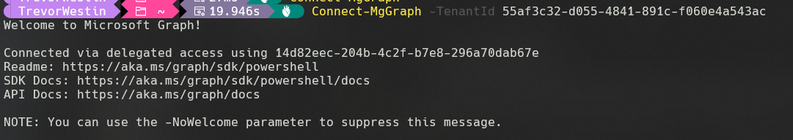
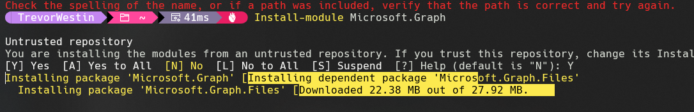

[Register a Microsoft Graph application](https://learn.microsoft.com/en-us/azure/active-directory-b2c/microsoft-graph-get-started?tabs=app-reg-ga)

[Start Making Calls](https://learn.microsoft.com/en-us/graph/auth-v2-service?tabs=http#4-get-an-access-token)

[How to update azure ad b2c custom user attribute using graph api](https://stackoverflow.com/questions/63815710/how-to-update-azure-ad-b2c-custom-user-attribute-using-graph-api)

[PERMISSIONS: Manage user attributes and claims](https://learn.microsoft.com/en-us/entra/identity/role-based-access-control/custom-enterprise-app-permissions#manage-user-attributes-and-claims)

https://stackoverflow.com/questions/65919881/create-user-custom-attribute-for-whole-b2c-instance-via-graph-api-or-graph-sdk

1. ms store
   powershell 7
   windows terminal preview
2. open windows terminal preview... open settings... default
3. profile = powershell
4. Set-ExecutionPolicy Bypass -Scope Process -Force; Invoke-Expression ((New-Object System.Net.WebClient).DownloadString('
   https://ohmyposh.dev/install.ps1'))
5. open ps7 as admin... install posh font

see themse @ ohmyposh.dev/docs/themses

---

For all of the graph API stuff I needed the additional two roles

`Application Administer` and `Cloud Application Administer` Roles

## Relevant Calls

[MS Graph Explorer](https://developer.microsoft.com/en-us/graph/graph-explorer)

### POST

- Token Request

### GET

- Users
- Users/{ID}
- Users/{userPrincipalName}
- Groups/{ID}
- Groups

### DELETE

- Member From Group
