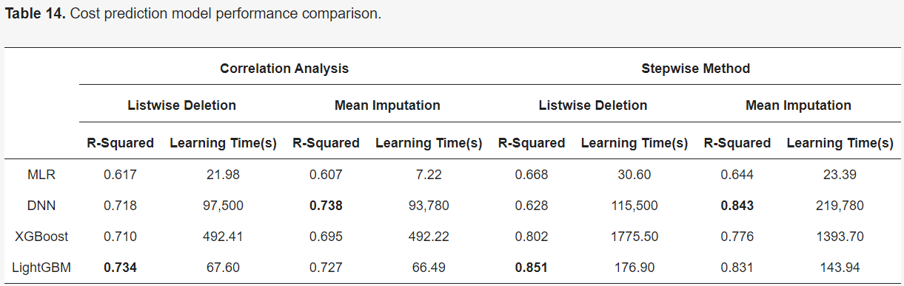

# Machine Learning Quote Bot Research

2/8/2024 - Trevor Westin

The following are my notes / summary from [Prediction of Shipping Cost on Freight Brokerage Platform Using Machine Learning](https://www.mdpi.com/2071-1050/15/2/1122).

## Abstract

This study derives the main variables that influence the setting of the shipping costs and presents the recommended shipping cost given by a price prediction model using machine learning methods.

The cost prediction model was built using four algorithms: multiple linear regression, deep neural network, XGBoost regression, and LightGBM regression. R-squared was used as the performance evaluation index.

In view of the results of this study, LightGBM was chosen as the model with the greatest explanatory power and the fastest processing. Furthermore, the range of the predicted shipping costs was determined considering realistic usage patterns. The confidence interval was used as the method of calculation for the range of the predicted shipping costs, and, for this purpose, the dataset was classified using the K-fold cross-validation method.

This paper could be used to set the shipping costs on freight brokerage platforms and to improve utilization rates.

## Intro

We present a method for setting the range of predicted fares considering realistic usage behaviors; the fares should be presented as a range rather than as a single value to the user.

The machine learning algorithms we used were multiple linear regression (MLR), deep neural networks (DNNs), extreme gradient boosting (XGBoost) regression, and light gradient boosting machine (LightGBM) regression. LightGBM is a model that reduces the learning time compared to the XGBoost model.

A total of 30 training sets were generated using k-fold cross-validation. Assuming that the 30 derived predicted values follow a normal distribution, a confidence interval was calculated, and an appropriate fare range was presented.

R-squared was used as the performance evaluation index for the predictive model.

## Literature Review

### Prior Studies

- Kovács calculated road freight shipping costs, which previously had only been estimated. Transport-related factors such as “distance,” “fuel,” “price,” and “highway toll” were selected to calculate the cost. A predictive model based on multiple regression analysis was built using the selected factors, and it demonstrated an excellent predictive performance.
- Lindsey et al. investigated factors that affect truck fare rates in North America and found that factors such as “distance” and “truck type” were the most important factors for determining the shipping costs.

### Theoretical Background

According to the learning method, machine learning is categorized as supervised learning and unsupervised learning. Supervised learning is a learning algorithm that learns data with input and output values, and it predicts output values for unseen data or future data. It is used for classification or regression analysis.

## Data Collection and Preprocessing

### Data Collections

For this study, we collected freight brokerage data that were registered on the freight brokerage platform within the 6 months from April to September 2020.

The dataset consists of 1,885,033 data observations and 78 variables used by freight brokerages, such as cargo information, vehicle type, vehicle tonnage, loading date and time, and unloading date and time.

### Data Preprocessing

#### Creating and Removing Variables

In the dataset, variables that were related to the personal information of the cargo owners and vehicle owners, such as name, vehicle number, and phone number, were deleted, as they were judged to be irrelevant to the shipping cost prediction.

The latitude and longitude of the upper and lower location were calculated using the haversine distance formula and were added as a “linear distance.”

It was judged that detailed date and time information could affect the cost setting, so the arrival and departure dates were subdivided into the month, day, day of the week, and time, and new variables were created for each.

In addition, we added the precipitation amount as a new factor, considering that the weather conditions at the time of the cargo transport would affect the shipping cost. The precipitation data of the Korea Meteorological Administration were used, and the precipitation value was added by considering the loading and unloading locations and dates.

#### Removing Data Outliers

The interquartile range (IQR) was used to remove outliers in the data. Outlier removal was applied only to continuous variables.

#### Handling Missing Data

After applying two methods for managing missing values, we compared which method was more useful. Before the processing of missing values, factors for which more than 50% of the data were missing were determined to be factors that did not have a great influence on the prediction and were, thus, removed. We removed 20 factors, including “load/unload name address,” “summary,” and “order number.” For the missing value treatment, listwise deletion and the mean imputation were used, and a dataset was created to which each treatment for missing values was applied. The listwise deletion removed all data with missing values, and the mean imputation replaced the missing values with the average value of each factor.

## Derivation of Key Factors

Correlational analysis and step selection were applied as a means to derive the major factors.

### Correlational Analysis

In this study, independent variables with a correlation coefficient of 0.1 or higher, which is judged to indicate a linear relationship between the independent variable and the dependent variable, were judged to be the main factors.

### Stepwise Method

The stepwise method was one of the methods used for selecting several independent variables to be included in the regression model. It is a method that is used to find the variable constituting the optimal regression model by repeating the addition and removal of variables. The selected variable was judged to be a strong predictor in the prediction model.

## Model Construction and Analysis Results

### Data Preparation

Min–max normalization, which converts all continuous variable data to values between 0 and 1, was used for normalization. We attempted to derive the shipping cost as a range using the confidence interval. To derive the shipping cost as a range, a 95% confidence interval was calculated for the cost value predicted by the shipping cost prediction model.

For the suitability of the model, 80% of the collected data were allocated to a training set and 20% to a test set, and the datasets were then used for the model construction and verification. At this time, to derive the cost range, the training set was divided into 30 folds through K-fold cross-validation, and 30 predicted values were derived by predicting the test set for each iteration. For each iteration, 29 training sets and 1 validation set were used. After that, the model was trained on the training set of each fold, and the process of predicting with the test set was repeated until 30 predicted values were derived. Afterward, the maximum and minimum values in the confidence interval were determined as the upper and lower limits of the prediction interval to estimate the predicted cost range. Overall configuration of a dataset for range prediction is shown in Figure 2.

This study was conducted using Python version 3.9. Python language-based TensorFlow and the scikit-learn machine learning algorithms were also used.

### MLR

...

### DNN

...

### XGBoost Regression

...

### LightGBM

...

### Model Comparison

The LightGBM model has the best predictive power, followed by the XGBoost and DNN, and the MLR model has the lowest predictive power.

The time required for model learning is also an important factor to consider for field applications. If a model takes a long time to learn, even if it shows a high accuracy, it may be difficult to apply to a field where rapid decision-making is required. The learning time of the correlation analysis method with few variables to consider was short, and the model with the shortest required time was the MLR model. The second shortest required time model was the LightGBM. The DNN model had a high predictive power, but it took a long time to learn compared with the other models, so it was judged to be difficult to apply in the field.

Considering both the speed and performance among the machine learning models, the LightGBM model was judged to be the most suitable for predicting the shipping cost. If the model performance is optimized in the future, the accuracy of the model could be further increased.

### Variable Importance

Another purpose of this study was to derive factors that affect the cost setting. In order to derive these factors, the variable with the greatest contribution to the prediction of the shipping cost was identified using Shapley Additive exPlanations (SHAP).

The factors that make a high contribution to the shipping cost prediction are “linear distance,” “actual distance,” “freight weight,” and “vehicle tonnage,” which are highly related to transportation distance and freight characteristics. In particular, “linear distance” showed a high contribution of greater than 50%. It was judged that “linear distance” has a greater influence than “actual distance” in determining the shipping cost.

## Conclusions and Future Research

The model that showed the best predictive power among the models used was the LightGBM model.

The factors that contributed the most to the cost setting was “linear distance,” and “actual distance,” “freight weight,” and “vehicle tonnage” were also found to be major variables that influence the cost setting.

No valid results were obtained for “precipitation,” which was thought to affect the forecast of the shipping costs. This is believed to be due to the characteristics of the freight market. In the actual freight market, cargo transport volume decreases on rainy days. Since the data used in this study are the data of cargoes that have completed freight transportation, these market conditions do not appear.

In future studies, we will generate and analyze meaningful data by changing the preprocessing method of environmental factors. In addition, other factors such as “highway fee” and “fuel cost” will be added to determine which environmental factors affect the shipping costs.
