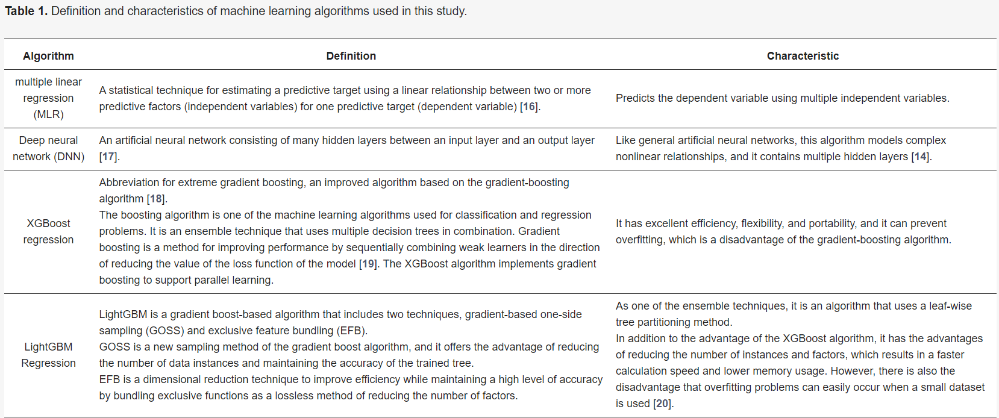

# Machine Learning Quote Bot Research

2/8/2024 - Trevor Westin

The following are my notes / summary from [Prediction of Shipping Cost on Freight Brokerage Platform Using Machine Learning](https://www.mdpi.com/2071-1050/15/2/1122).

## Abstract

This study derives the main variables that influence the setting of the shipping costs and presents the recommended shipping cost given by a price prediction model using machine learning methods.

The cost prediction model was built using four algorithms: multiple linear regression, deep neural network, XGBoost regression, and LightGBM regression. R-squared was used as the performance evaluation index. In view of the results of this study, LightGBM was chosen as the model with the greatest explanatory power and the fastest processing. Furthermore, the range of the predicted shipping costs was determined considering realistic usage patterns. The confidence interval was used as the method of calculation for the range of the predicted shipping costs, and, for this purpose, the dataset was classified using the K-fold cross-validation method. This paper could be used to set the shipping costs on freight brokerage platforms and to improve utilization rates.

## Intro

Currently, the criteria for setting the shipping costs simply consider distance and vehicle tonnage.

We present a method for setting the range of predicted fares considering realistic usage behaviors; the fares should be presented as a range rather than as a single value to the user.

The machine learning algorithms we used were multiple linear regression (MLR), deep neural networks (DNNs), extreme gradient boosting (XGBoost) regression, and light gradient boosting machine (LightGBM) regression. LightGBM is a model that reduces the learning time compared to the XGBoost model.

A total of 30 training sets were generated using k-fold cross-validation. Assuming that the 30 derived predicted values follow a normal distribution, a confidence interval was calculated, and an appropriate fare range was presented.

R-squared was used as the performance evaluation index for the predictive model.

## Literature Review

### Prior Studies

- Kovács [4] calculated road freight shipping costs, which previously had only been estimated. Transport-related factors such as “distance,” “fuel,” “price,” and “highway toll” were selected to calculate the cost. A predictive model based on multiple regression analysis was built using the selected factors, and it demonstrated an excellent predictive performance.
- Lindsey et al. [7] investigated factors that affect truck fare rates in North America and found that factors such as “distance” and “truck type” were the most important factors for determining the shipping costs.

