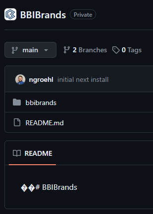

# Time sensative steps!!!

- Get domain registered in the static web app

# Azure x Nextjs

## Known Issues: Azure x Nextjs

Azure supports two different kinds of Nextjs hosting... 1.Static HTML 2."Hybrid"(required for SSR, Image Opt, and API routes)

- ["Hybrid" tutorial](https://learn.microsoft.com/en-us/azure/static-web-apps/deploy-nextjs-hybrid)

  - [Unsupported features in preview](https://learn.microsoft.com/en-us/azure/static-web-apps/deploy-nextjs-hybrid#unsupported-features-in-preview)

- **IMPORTANT**: The maximum app size for the hybrid Next.js application is 100 MB!!!!!!

- **IMPORTANT**: The default static web app resource uses node version 16. We want to use the latest version of node (20.x)... but we can't... azure static web apps doesn't support node 20 yet.... But they do support 18x so lets use the latest LTS version of node 18.x which is `Node v18.19.0 (LTS)`

- **IMPORTANT**: Enable the standalone feature for your Next.js project in the next.config.js file. (this helps keep the app under 100mb otherwise don't worry about it)

  ```
  module.exports = {
      output: "standalone",
  }
  ```

## Steps to recreate deployment test




sry i know this isn't the best documentation... Looking to come back to this to put together a full step by step tutorial for nextjs with azure...

2.Problem: Azure defaults static web apps to use node version 16, however nextjs13 and above requires atleast node 18.
2.Solution(s): Add to package.json:

```
"engines": {
    "node": "18.17.1"
}
```

(Azure Static Web does NOT support node 20)
(absolutely nowhere is this documented...) If this fails try to specify node version in workflow file as well in the next step.

# Set up Node.js environment

Add the following step before

```yml
- name: Setup Node.js
  uses: actions/setup-node@v3
  with:
    node-version: "18.17.1" # Replace with your desired version but make sure it's compatible with azure static web apps.
```

If this fails go to `https://shell.azure.com/` and attempt to run `az webapp config appsettings set --name <app-name> --resource-group <resource-group-name> --settings WEBSITE_NODE_DEFAULT_VERSION="~18"` however this requires "mounted storage" whatever that is.

Also note that there is limited functionality between azure cli for static web apps using nextjs.... sucks..
